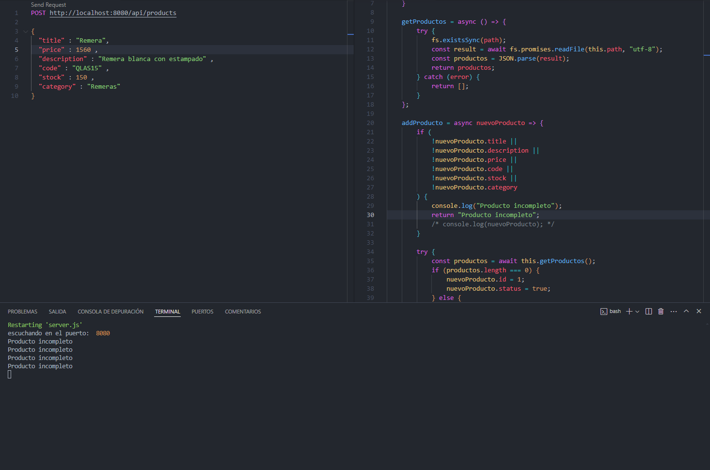

<strong>Proyecto de Backend.js</strong>

Proyecto desarrollado por Federico Pedraza utilizando express.js para el curso de Desarrollo Avanzado Back End comision : c70125

<strong>Instalación</strong>

1. Instalar las dependencias:
   Utilizar en el cmd ubicandote sobre la carpeta del proyecto el comando : npm i
2. Iniciar la aplicación:
   En la misma consola una vez terminado el proceso de instalacion de el paquete npm, introducir el comando npm run dev.
3. Las peticiones pueden ser realizadas con postman con Postman o con la extension Rest Client (URL a la que hacer la peticion)
   1. Metodo Get: `http://localhost:8080/api/products`
   2. Metodo Get por id: `http://localhost:8080/api/:pid`
   3. Metodo Post: `http://localhost:8080/api/products`
   4. Metodo Put: `http://localhost:8080/api/products/:pid`
   5. Metodo Delete:`http://localhost:8080/api/products/:pid`
   6. Metodo Get Cart: `http://localhost:8080/api/carts`
   7. Metodo Get Cart por id: `http://localhost:8080/api/carts/:cid`
   8. Metodo Post para crear carrito: `http://localhost:8080/api/carts`
   9. Metodo Post para aumentar cantidad de objetos en carrito: `http://localhost:8080/api/carts/:cid/product/:pid`

Dejo constancia de el error que estoy teniendo no entiendo porque cuando quiero escribir el producto me dice que el producto es incompleto cuando pongo todos los parametros solicitados cuando cree el metodo addProducto. La primera vez que finalice el proyecto si me tomo el POST creandome el objeto guardapolvo que tengo en base de datos pero luego no me funciono mas.

